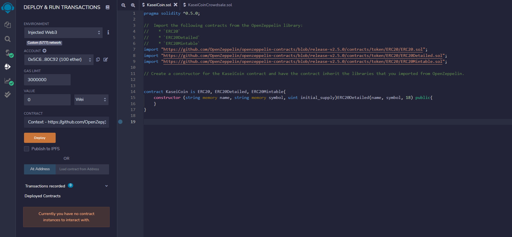
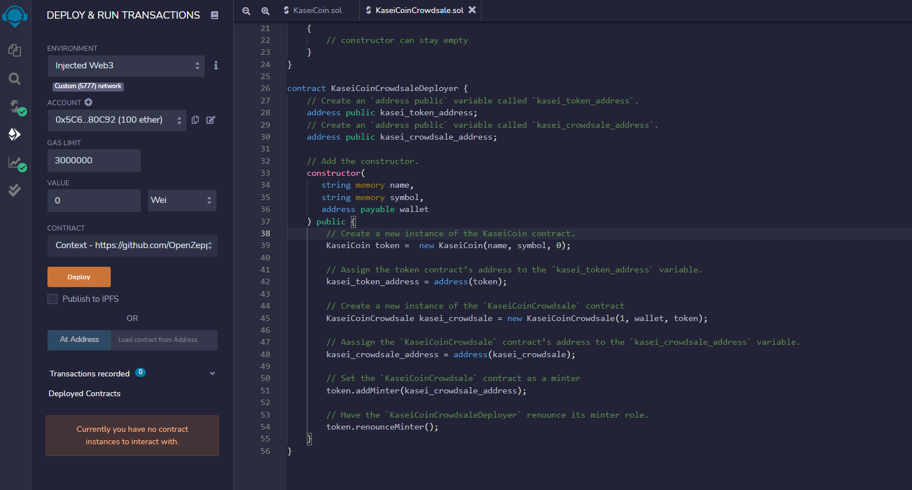
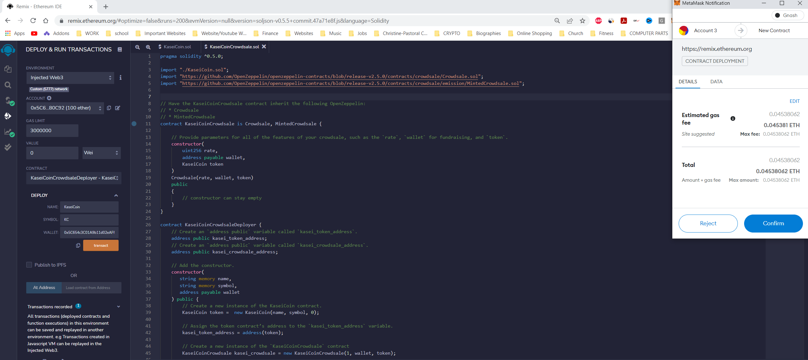
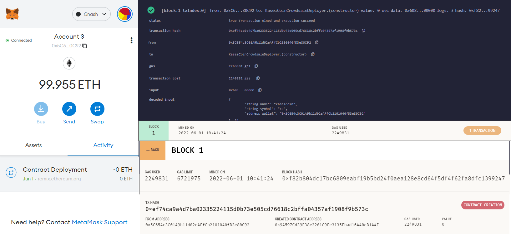
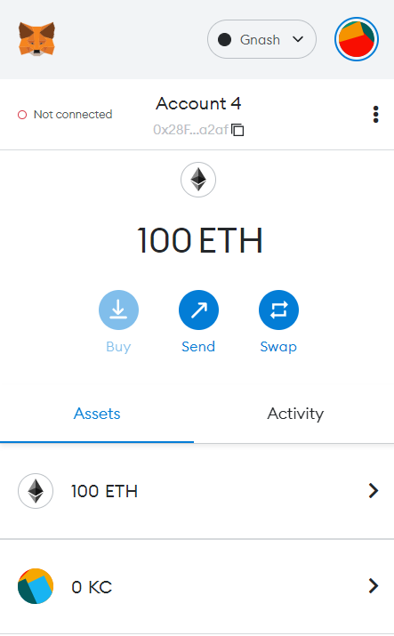
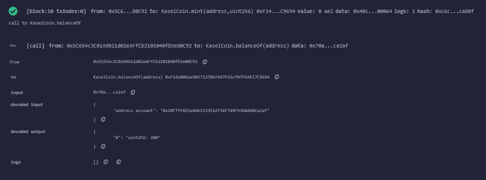
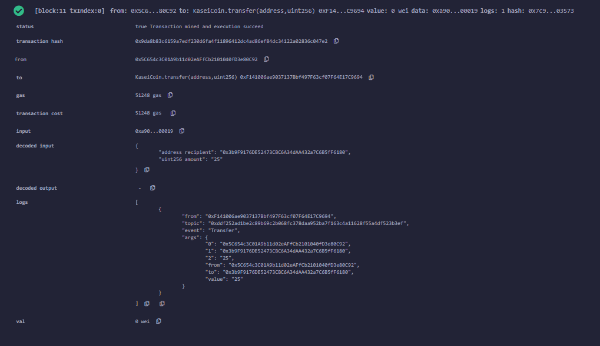
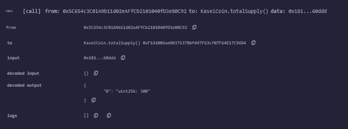

# Fintech-Token-Sale

## Overview

This repository includes 2 contracts for a crowd token sale on the ethereum network.

1. [Kasei Coin](https://github.com/muramemory/Fintech-Token-Sale/blob/main/KaseiCoin.sol)
2. [Kasei Coin Crowd Sale](https://github.com/muramemory/Fintech-Token-Sale/blob/main/KaseiCoinCrowdsale.sol)

Kasein Coin includes the libraries imported to activate the ethereum token and also the constructor function to intiate the token properties.

Kasei Coin Crowd Sale includes the code functions for minting, depositing, withdrawing and other actions that can be performed on the blockchain.

Applications used:
- remix.ethereum.org
- Ganache
- Visual Studio Code

## Results

### Kasei Coin Crowd Sale Contract Compile

### Kasei Coin Crowd Sale Deployer Contract Compile

### Metamask Deployment Successful

### KC Coin Import to Metamask

### Balance Of Test

### Transfer To Another Wallet

### Total Supply

